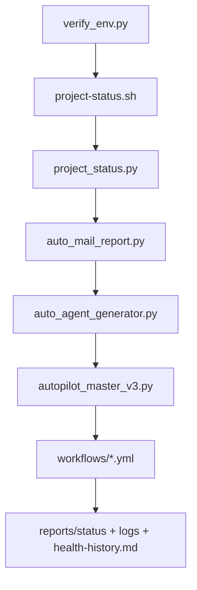

# 🧠 Agentic Autopilot — Arquitectura General

📅 Generado automáticamente: 2025-10-12 15:52

```mermaid
flowchart TD
    A[verify_env.py] --> B[project-status.sh]
    B --> C[project_status.py]
    C --> D[auto_mail_report.py]
    D --> E[auto_agent_generator.py]
    E --> F[autopilot_master_v3.py]
    F --> G[workflows/*.yml]
    G --> H[reports/status + logs + health-history.md]
```
