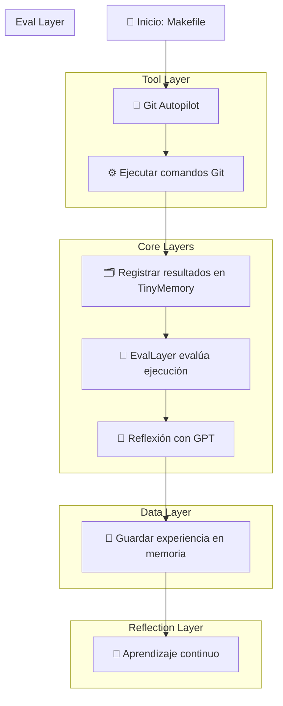

# 🧠 Agentic Autopilot System

## 🧩 Diagrama general del flujo de agentes

---

## 📘 Descripción

Este diagrama muestra la interacción entre las capas del sistema **Agentic Autopilot**:

* **Tool Layer** → Ejecuta comandos y obtiene resultados (por ejemplo, `GitAutopilot`).
* **Data Layer** → Almacena los logs y salidas de los agentes en la memoria (`TinyMemory`).
* **Eval Layer** → Evalúa automáticamente la calidad de cada ejecución.
* **Reflection Layer** → Interpreta errores con IA (GPT) y propone mejoras.
* **Learning Loop** → Los resultados se integran en la memoria para realimentar el sistema.

De esta forma, cada agente puede **actuar, reflexionar, aprender y mejorar**, siguiendo un ciclo de mejora continua totalmente automatizado.
