# 🧠 Agentic Autopilot System

## 🧩 Diagrama general del flujo de agentes

```mermaid
graph TD
    A[🔹 Inicio: Makefile] --> B[🧠 Git Autopilot]
    B --> C[⚙️ Ejecutar comandos Git]
    C --> D[🗂 Registrar resultados en TinyMemory]
    D --> E[🧮 EvalLayer evalúa ejecución]
    E --> F[🧠 Reflexión con GPT]
    F --> G[🧾 Guardar experiencia en memoria]
    G --> H[🔁 Aprendizaje continuo]

    subgraph Core Layers
        D
        E
        F
    end

    subgraph Tool Layer
        B
        C
    end

    subgraph Data Layer
        D
        G
    end

    subgraph Eval Layer
        E
    end

    subgraph Reflection Layer
        F
        H
    end
```

---

## 📘 Descripción

Este diagrama muestra la interacción entre las capas del sistema **Agentic Autopilot**:

* **Tool Layer** → Ejecuta comandos y obtiene resultados (por ejemplo, `GitAutopilot`).
* **Data Layer** → Almacena los logs y salidas de los agentes en la memoria (`TinyMemory`).
* **Eval Layer** → Evalúa automáticamente la calidad de cada ejecución.
* **Reflection Layer** → Interpreta errores con IA (GPT) y propone mejoras.
* **Learning Loop** → Los resultados se integran en la memoria para realimentar el sistema.

De esta forma, cada agente puede **actuar, reflexionar, aprender y mejorar**, siguiendo un ciclo de mejora continua totalmente automatizado.
